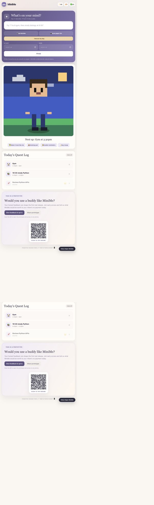

# MiniMe

A pixel productivity buddy for planning a day, completing small tasks and seeing progress. Built as an interactive browser prototype, with a React/Vinext shell and an optional Cloudflare Worker feedback endpoint.



## What works

- Add individual tasks or supported text plans, such as `7-8am gym, study at 9am`.
- Mark tasks complete, remove them and view a daily recap.
- Keep the current day's tasks and progress in this browser's local storage.
- Animate a canvas companion and show energy and streak indicators.
- Preview and apply a shorter schedule with **Rescue my day**.
- Customise the avatar and use an in-page pet fallback.
- Submit consented prototype feedback through the optional Worker/D1 backend.

This is a rule-based planner, not a trained AI model or LLM. Some time shorthand is not recognised; check the task list and use the time pickers when needed.

## Run the complete application

Use Node.js **24** (minimum supported by the project: 22.13) and npm.

```sh
npm ci
npm run dev
```

Open the local address printed by the server. The local Cloudflare development integration provides a simulated D1 database for the feedback endpoint. No hosted database or API key is required for the local prototype.

```sh
npm test
```

This builds the application and runs four checks covering the rendered MiniMe shell, unsupported feedback methods, feedback validation and bound SQL persistence. Feedback tests use a database test double; they do not prove a production D1 deployment.

## Frontend-only demo

To explore the planner without installing Node dependencies:

```sh
python3 -m http.server 8000 --bind 127.0.0.1 --directory public
```

Open `http://127.0.0.1:8000/minime/index.html`. Planning and local storage work here; `/api/feedback` does not exist on a static Python server. Do not submit real personal information to a local demonstration.

## Architecture

```text
React/Vinext page -> embedded browser application
                         |
             text parser + task state -> canvas companion
                         |
                    localStorage

Feedback form -> Worker POST /api/feedback -> bound SQL -> D1
```

- `public/minime/`: HTML, CSS, planner, avatar, canvas animation and service worker.
- `app/`: accessible application shell and metadata.
- `worker/`: feedback validation and parameterised database writes.
- `db/`, `drizzle/`: schema and migration sources.
- `build/`: source build integration, not generated output.
- `.openai/hosting.json`: logical bindings only; no original deployment identifier.
- `tests/`: application and feedback contract checks.

## Verification

Rechecked on 25 September 2026 with Node 24.19.0:

- Production build succeeded; all 4 application checks passed.
- Browser checks passed for task creation, completion, reload persistence, recap display and rescheduling preview/application.
- No microphone, camera or notification permission was granted during verification.

See [demo walkthrough](docs/DEMO.md) for a short reproducible presentation.

## Browser support and limits

| Capability | Current behaviour |
| --- | --- |
| Text planning, task list, canvas | Core browser experience; supports a limited grammar |
| Voice input | Uses browser SpeechRecognition; availability and processing vary by browser |
| Paper to Pet | Uses experimental TextDetector when available; otherwise shows manual text entry |
| Desktop pet | Document Picture-in-Picture when supported; otherwise an in-page fallback |
| Reminders | Require permission, a supported browser and an active app; not background push delivery |
| Offline shell | Service-worker cache after a successful visit; does not provide an offline feedback backend |
| Persistence | Device/browser-local, current-day tasks; no account or cross-device sync |

Feedback collection is prototype-only. The backend does not provide authentication, abuse controls, deletion tooling or a production privacy workflow. Existing QR artwork was created for the earlier hosted prototype and is not a new deployment guarantee. No new public app deployment is included in this repository release.

## Development notes

The project was developed with AI assistance. This publication pass replaces starter documentation/tests, makes sharing use the current origin, keeps notification prompts behind the explicit reminder control and limits service-worker cleanup to MiniMe caches. No employer data, user feedback database or credentials are included.

No project-wide reuse licence is granted in this release. Third-party dependencies retain their respective licences.
